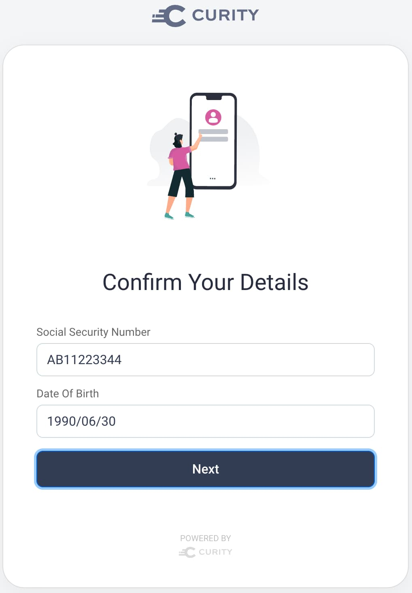

# Getting Started Authenticator

An example authenticator for training purposes, to explain custom authentication core behaviors.

## Core Behaviors

The authenticator demonstrates the initial areas you need to understand when getting started with plugins:

- Exposing HTTP endpoints for login forms.
- Frontend development to create both HTML and native forms.
- Backend processing to receive form data, validate it and return error messages.
- Backend identity logic and the use of SDK objects.

The [Getting Started with Authentication using Plugins](resources/learn/getting-started-authentication-plugins/) tutorial explains the code and core concepts.\
Once this plugin is understood, you are well-placed to implement many other custom authentication use cases.

## Prerequisites

First ensure that your environment meets the prerequisites:

- Java 21 SDK
- Maven
- Docker
- An [ngrok setup](https://curity.io/resources/learn/expose-local-curity-ngrok/)

To run the plugin in native mode you also need a mobile development environment:

- Android Studio
- Xcode

Also ensure that you have a `license.json` file for the Curity Identity Server, such as a trial license.\
The license should grant access to the plugin SDK and the Hypermedia Authentication API.

## Deploy the Authorization Server and Plugin

Run the following script to deploy the server components:

```bash
./deploy.sh
```

This will give you an external base URL such as the following:

```text
https://aa96-86-189-132-17.ngrok-free.app
```

You can inspect the example plugin's configuration settings by running the Admin UI with the following details.\
Then navigate to `System / Authentication Service / Authewnticators / Example`.

- URL: https://localhost:6749/admin
- Password: Password1


Re-run the `deploy.sh` script whenever you change the plugin's code.

## Test a Browser-Based Flow using HTML Forms

Follow the [OAuth tools website tutorial](https://curity.io/resources/learn/test-using-oauth-tools/) to enable a test setup.\
Create an environment using the ngrok base URL, then configure a code flow with the following details:

- Client ID: demo-web-client
- Client Secret: Password1
- Scope: openid
- Prompt: login

Run the code flow to step through the authentication plugin's screens.

## Test a Hypermedia Authentication API using Native Forms

Clone the HAAPI code examples with these commands:

```bash
git clone https://github.com/curityio/android-haapi-ui-sdk-demo
git clone https://github.com/curityio/ios-haapi-ui-sdk-demo
```

Edit both of these files and change the base URL to the ngrok value, then run the apps:

- For Android, the configuration file is at `app/src/main/java/io/curity/haapidemo/Configuration.kt`.
- For iOS, the configuration file is at `iOS/Configuration.swift`.

## Test Custom Logins

An example user account is created at the end of the [deployment data script](./resources/data-backup.sql).\
The user account includes custom attributes, and the plugin uses them during authentication:

- Account ID: 12345678
- Password: Password1
- Social Security Number: AB11223344
- Date of Birth: 1990/06/30

The example plugin uses a wizard-based approach to present multiple forms, so that you understand navigation.\
First, the user enters an account ID and password:


Next, the user provides their social security number and date of birth as further proofs of identity:



Finally, there is an authentication success screen:


## Designing Custom Authentication

There are often better ways to implement custom authentication than a wizard-based approach.\
For example, you can compose [authenticators](https://curity.io/resources/learn/authentication-overview/) and [authentication actions](https://curity.io/resources/learn/control-authentication-using-actions/), to reduce work.\
Yet the example plugin demonstrates that you have full control over all of the important areas:

- Forms, form elements and user experience
- Data, validation and identity logic

## More information

- Visit [curity.io](https://curity.io/) for more information about the Curity Identity Server.
